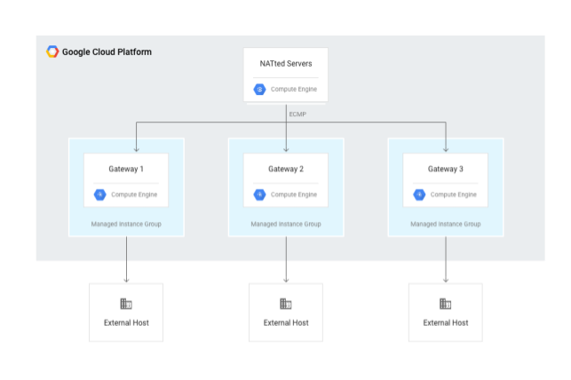

# Highly available NAT Gateway for GCE 

## Overview
This example shows how to create a highly available NAT gateway in several zones of a GCP region. It can be used by GCE VMs with internal only IP addresses to access internet resources. Traffic is balanced between the NAT gateways using equal cost based routing with equal route priorities to the same instance tag.

**Figure 1.** *Diagram of Google Cloud resources*



## Prerequisites
Make sure that **Google Cloud RuntimeConfig API** is enabled in Developers Console for your GCP project. Check [Enable and disable APIs](https://support.google.com/cloud/answer/6158841?hl=en) article for more information.

## Deployment
Use `config.yaml` to deploy this example template. Before deploying,
edit the file and specify parameters like project id, network, zones to deploy the gateway VMs. Review the full list of supported parameters in `ha-nat-gateway.py.schema`. 

When ready, deploy with the following command:

    gcloud deployment-manager deployments create ha-nat-example --config config.yaml

## Testing
Create a GCE instances without an external IP address, make sure it's tagged with a tag specified in *nated-vm-tag* parameter of your deployment, e.g.:

    gcloud compute instances create internal-ip-only-vm --no-address --tags no-ip --zone us-west1-a


SSH into the instance by hopping through one of the NAT gateway instances, first make sure that SSH agent is running and your private SSH key is added to the authentication agent.

```
eval ssh-agent $SHELL
ssh-add ~/.ssh/google_compute_engine
gcloud compute ssh $(gcloud compute instances list --filter=name~ha-nat-example- --limit=1 --uri) --zone us-west1-d --ssh-flag="-A" -- ssh  internal-ip-only-vm
```

Check that the VM can access external resources, note that IP address returned by curl will be one of the external IP addresses of our NAT gateways.
 
    while true; do curl http://ipinfo.io/ip; sleep 1; done

